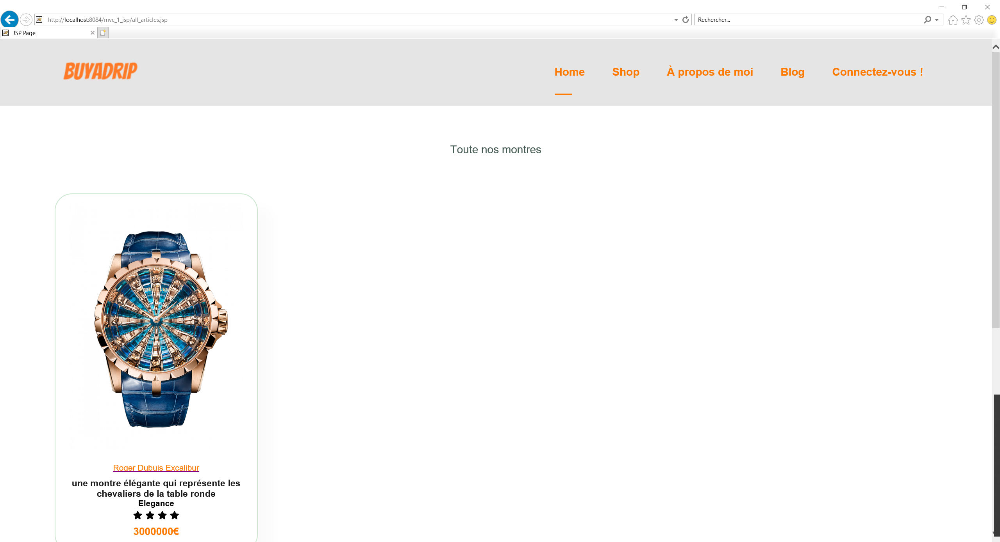
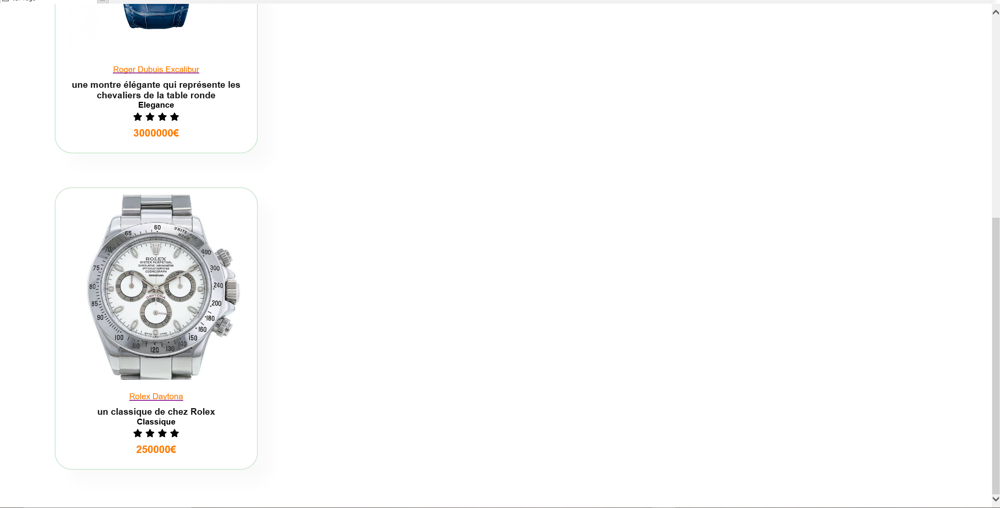
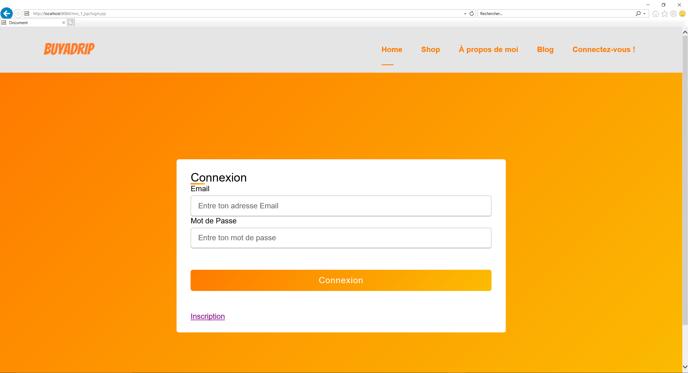
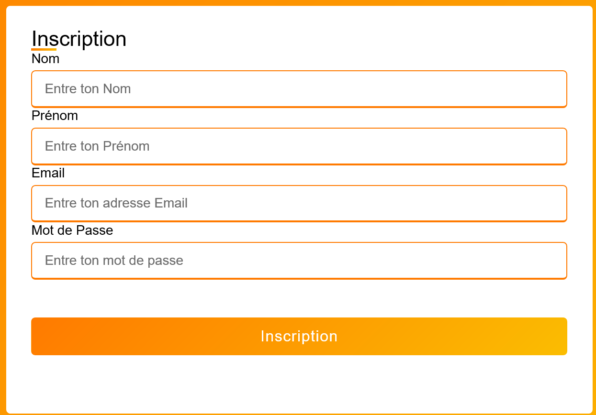
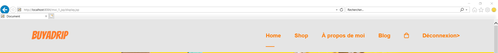
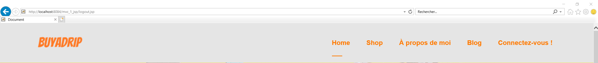
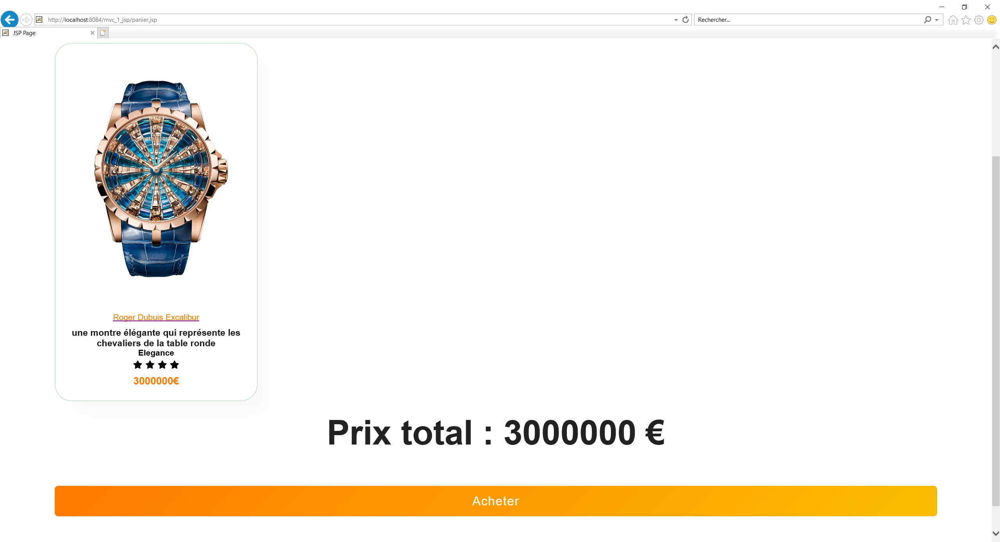
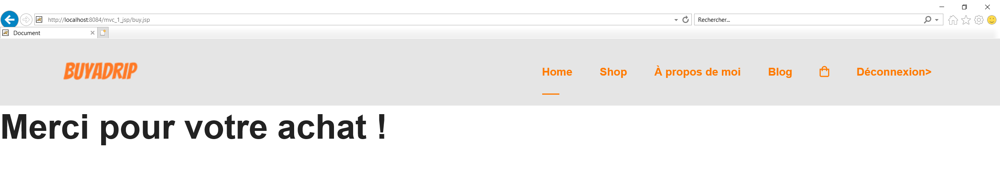

# ECOMMERCE

Dans le cadre d'un cours ```Technologies Web avec JEE```, on a dû créer un site d'ecommerce dans 3 versions différentes :  
-  ```Mix Servlet/JSP```
-  ```MVC 1 full JSP```
-  ```MVC 2 Servlet```

Il y a quelques problèmes lorsqu'on cherche à lancer le code en faisant un `git clone`. Il faut utiliser les projets se trouvant dans le fichier ```3_versions.zip```. 

Voici l'ensemble des fichiers qui se trouvent dans le projet :  
-  3 projets NetBeans qui correspondent aux 3 versions réalisé (mvc_1_jsp, mvc_2_servlet,servlet_jsp) 
- 2 fichiers de type sql dont leurs but sera de créer une base de données et la peupler avec des articles (createDatabase.sql, updateDatabase.sql) 
- une vidéo qui montre le fonctionnement du projet mvc_2_servlet (qui correspond à la version MVC 2 centré servlet) (demo-mvc_2_servlet.zip) 
- un rapport qui montre ce que l'on a réalisé dans chacun des projets (Rapport_JEE_Souef_Ravindrarasa.pdf) 

Pour lancer les projets, il faut dans un premier temps créer la base de données (voir la section Résultats du projet dans le rapport). On a utilisé le logiciel ```NetBeans 8.2```. 
Ensuite on peut simplement lancer le fichier index.jsp dans chaque version pour voir comment le site est conçu. 


# Quelques images provenant du site


> voici la page d'accueil de notre site  




> Voici la page contenant tous les articles de notre site web   
 L'utilisateur aura aussi la possibilité de se créer un compte ou bien de s'inscrire 

 
  
> voici les pages d'inscription et de connexion sur le site  

   
Bien sûr la navbar change en fonction du fait que l'utilisateur soit connecté ou non.
  

> voici la navbar selon que l'utilisateur soit connecté (affiche du bouton déconnexion) ou qu'il soit pat connecté (affiche du bouton connectez-vous)  

Un utilisateur peut aussi ajouter des produits à son panier et valider ce dernier. 
 
 
> voici les pages qui représente respectivement le panier et la page de validation